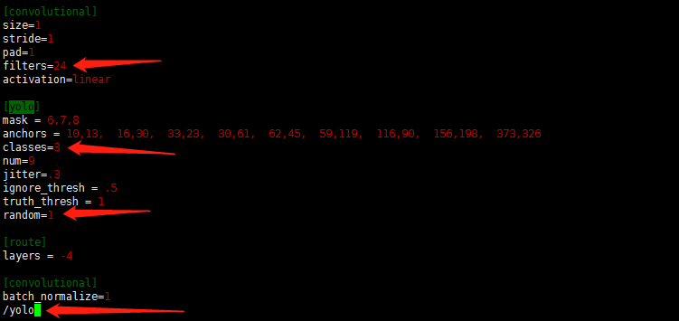

# YOLOV3-Training-Your-Own-Dataset
# Darknet-yolov3 training your own dataset

Environment: Ubuntu 18.04

Paper:[Yolov3.pdf](https://pjreddie.com/media/files/papers/YOLOv3.pdf)

## Download and compile Darknet
    $ git clone https://github.com/pjreddie/darknet
    $ cd darknet
    
**1. Change makefile(optional)** ---> `vim Makefile`

* Want to use GPU  --->   `GPU=1`

* Want to use openCV   --->   `OPENCV=1`

* Want to use CUDNN
```
 CUDNN=1
 NVCC=/usr/local/cuda-10.0/bin/nvcc
```

**2. Compile**  --->   `make`


**3. Test**

Download a pre-trained model to test --> `wget https://pjreddie.com/media/files/yolov3.weights`

Then test the dog picture ---> ` ./darknet detect cfg/yolov3.cfg yolov3.weights data/dog.jpg`

you will get a picture `prediction.jpg` like this


## Prepare your training data
The following tutorial is to detect three different kinds of objects: `person`,`cat`,`dog`, 
and use [labelImg](https://github.com/tzutalin/labelImg) to label pictures.

**1.Download [labelImg](https://tzutalin.github.io/labelImg/):**
- Double click to run


- The saved file is in XML format:


**2.Create `myData` folder in the Darknet directory** 

Put the previously marked pictures and XML files in the corresponding directory,
the directory structure is as follows. 
```
myData
  ...JPEGImages #Storing images
 
  ...Annotations #Storing the XML file corresponding to the image
 
  ...ImageSets/Main #The name where the training/validation images are stored（The format is like 000001.jpg or 000001), which includes train.txt.
```
**3.Create `test.py` under `myData`, copy the following code into `test.py` and run it. 
Four files will be generated: train.txt, val.txt, test.txt and trainval.txt.**

    import os
    import random

    trainval_percent = 0.1
    train_percent = 0.9
    xmlfilepath = 'Annotations'
    txtsavepath = 'ImageSets\Main'
    total_xml = os.listdir(xmlfilepath)
    num = len(total_xml)
    list = range(num)
    tv = int(num * trainval_percent)
    tr = int(tv * train_percent)
    trainval = random.sample(list, tv)
    train = random.sample(trainval, tr)
    
    ftrainval = open('ImageSets/Main/trainval.txt', 'w')
    ftest = open('ImageSets/Main/test.txt', 'w')
    ftrain = open('ImageSets/Main/train.txt', 'w')
    fval = open('ImageSets/Main/val.txt', 'w')
    
    for i in list:
        name = total_xml[i][:-4] + '\n'
        if i in trainval:
            ftrainval.write(name)
            if i in train:
                ftest.write(name)
            else:
                fval.write(name)
        else:
            ftrain.write(name)
    
    ftrainval.close()
    ftrain.close()
    fval.close()
    ftest.close()
    
After running `test.py`,the following files will be generated in `~/darknet/myData/ImageSets/Main`


**4.Convert data to the format supported by Darknet**

Yolov3 provides the code to convert the VOC data set into the format required by Yolo training, 
which is displayed in `scripts/voc_label.py` scripts file. Here is a modified version, create `my_lables.py`in the darknet folder.
The contents are as follows:

    import xml.etree.ElementTree as ET
    import pickle
    import os
    from os import listdir, getcwd
    from os.path import join
     
    #source code 
    sets=[('2012', 'train'), ('2012', 'val'), ('2007', 'train'), ('2007', 'val'), ('2007', 'test')]
    #Change it to mydata
    sets=[('myData', 'train')] 
     
    #Change it to your own categories 
    classes = ["person", "cat", "dog"] 
     
    def convert(size, box):
        dw = 1./(size[0])
        dh = 1./(size[1])
        x = (box[0] + box[1])/2.0 - 1
        y = (box[2] + box[3])/2.0 - 1
        w = box[1] - box[0]
        h = box[3] - box[2]
        x = x*dw
        w = w*dw
        y = y*dh
        h = h*dh
        return (x,y,w,h)
     
    def convert_annotation(year, image_id):
        in_file = open('myData/Annotations/%s.xml'%(image_id))  #source code:VOCdevkit/VOC%s/Annotations/%s.xml
        out_file = open('myData/labels/%s.txt'%(image_id), 'w')  #source code:VOCdevkit/VOC%s/labels/%s.txt
        tree=ET.parse(in_file)
        root = tree.getroot()
        size = root.find('size')
        w = int(size.find('width').text)
        h = int(size.find('height').text)
     
        for obj in root.iter('object'):
            difficult = obj.find('difficult').text
            cls = obj.find('name').text
            if cls not in classes or int(difficult)==1:
                continue
            cls_id = classes.index(cls)
            xmlbox = obj.find('bndbox')
            b = (float(xmlbox.find('xmin').text), float(xmlbox.find('xmax').text), float(xmlbox.find('ymin').text), float(xmlbox.find('ymax').text))
            bb = convert((w,h), b)
            out_file.write(str(cls_id) + " " + " ".join([str(a) for a in bb]) + '\n')
     
    wd = getcwd()
     
    for year, image_set in sets:
        if not os.path.exists('myData/labels/'):  # change it to myData
            os.makedirs('myData/labels/')
        image_ids = open('myData/ImageSets/Main/%s.txt'%(image_set)).read().strip().split()
        list_file = open('myData/%s_%s.txt'%(year, image_set), 'w')
        for image_id in image_ids:
            list_file.write('%s/myData/JPEGImages/%s.jpg\n'%(wd, image_id))
            convert_annotation(year, image_id)
        list_file.close()
        
Running the scripts:

      $ python darknet/my_label.py
It will generate a txt file `myData_train.txt`(content: category code and relative position of target),
in the directory `darknet/myData/labels/myData_train.txt`
The meaning of "txt file" in the labels file is:
 

## Edit config file
**1.Modify `voc.data` and `yolov3-voc.cfg` in `~/darknet/cfg`**
Copy the two files and rename them `my_data.data` and `my_yolov3.cfg`

`my_data.data` content:
```
##Change to your own number of categories
classes= 3 
##Change to your own path
train  = /home/XXX/darknet/myData/myData_train.txt  
names = /home/XXX/darknet/myData/myData.names #the file will be created later
backup = backup #Where weight is stored
```
`my_yolov3.cfg`:

    $ vim ./darknet/cfg/my_yolov3.cfg
    $ /yolo
There are three [yolo] layers in total, change all of them.In front of every [yolo] layer there is a [convolutional] layer, change filter number. 
Every place should be modified according to your number of categories.
```
filters：3*（5+len（classes））
#take this project for example
filters = 24
classes = 3
```


**2.specify training batches and training rounds**


Because it's training, annotate testing and open training.

**3.Create `myData.names` file in the `~/darknet/myData`**
```
##You can change to names of your project
people
cat
dog
```
## Begin training
**1.Download pre-trained weights**

    $ wget https://pjreddie.com/media/files/darknet53.conv.74
**2.Start training**

    $ ./darknet detector train cfg/my_data.data cfg/my_yolov3.cfg darknet53.conv.74
Or specify gpu training, and use gpu0 by default(you can use `nvidia-smi` to view gpu information )
   
    $ ./darknet detector train cfg/my_data.data cfg/my_yolov3.cfg darknet53.conv.74 -gups 0,1,2,34
 Every 100 iterations, a model weight is generated on the backup folder,
when AVG loss doesn't drop in several iterations, you can stop training.


